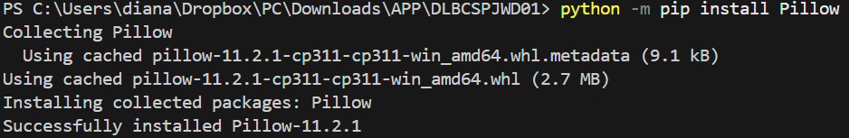
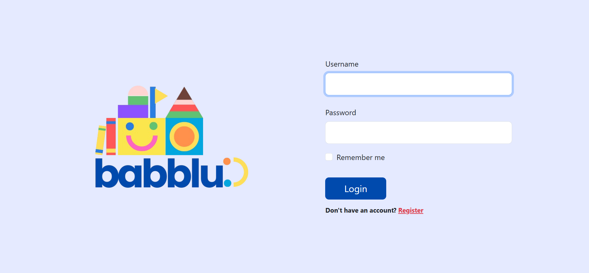

# BABBLU - Communication Web Application
**Babblu** is an assistive web application specifically designed to help individuals with speech difficulties (children with Autism Spectrum Disorder, Down sydrome, or other speech impairments) to communicate more easily and independently. Many individuals who face difficulties in verbal expressions often rely on caregivers, teachers, or therapists for day-to-day communication. Babblu aims to reduce this dependency by providing a friendly and interactive platform where users can express their thoughts and needs using image-based cards combined with text-to-speech technology.

## Features
- Add cards with images and custom text.
- Click cards to trigger speech using Web Speech API.
- Choose between multiple themes (blue, pink, neutral).
- User authentication system (signup/login/logout).
- User profile page.
- Responsive design using Bootstrap 5 and CSS.

## Technology stack
### Frontend:
- HTML5 - used to create the layout of the homepage, card creation form, and other pages such as login/signup. 
- CSS3 - used to style the layout, to control spacing, fonts, and responsiveness of the interface.
- JavaScript - enables speech synthesis using the Web speech API. Dynamically creates speech boxes and responds to user actions. Handles text-to-speech functionality. Controls components like voice selection, toggling text box, and applying active styles.
- Bootstrap 5 - accelerates frontend development with pre-built classes and components like navigation bars, profiles, and buttons.
- Web Speech API (https://developer.mozilla.org/en-US/docs/Web/API/Web_Speech_API) - powers the text-to-speech feature where users click on cards or type text, and the browser reads it out loud. It provides voice selection and handles speech synthesis.

### Backend:
- Python 3.11.9 - the core programming language for building the backend.
- Django 5.1.7 (Python web framework) - handles routing (URLs), views, and models. Manages user authentication. Processes form submissions to create speech cards. Provides an admin interface for managing users and user-defined speech cards.
- SQLite - default Django database. Stores users and user-defined speech cards.

## INSTALLATION AND RUN GUIDE
These steps will help you set up and run the app on your local machine.

## Prerequisites
Ensure you have the following installed:
- Visual Studio Code (https://code.visualstudio.com/download)
- Python 3.10 or higher (https://www.python.org/downloads/)
- Git (https://git-scm.com/downloads)

Check versions in your terminal in VS Code:
- python --version
- git --version

## Step 1: Clone the project repository
1. Open Visual Studio Code, then the terminal.
2. Run this command to clone the repository `git clone https://github.com/dianabali/DLBCSPJWD01`. After that, you will see something like this:

3. Navigate inside the DLBCSPJWD01 folder by running `cd your-path-to-DLBCSPJWD01` like this:

## Step 2: Set up a virtual environment
Inside the project repository, install Pipenv using `python -m pip install pipenv`. This will create a virtual environment and install all dependencies listed in the Pipfile.

## Step 3: Enter the virtual environment
Activate the virtual environment using `python -m pipenv shell`. After that, you will see something like this:

## Step 4: Install Django, widget tweaks, and Pillow

1. Install Django using `python -m pip install django`.

**NOTE:** In case you see this error `ModuleNotFoundError: No module named '_distutils_hack'`, run this command `python -m pip install --upgrade pip setuptools`.

2. Install Django widget tweaks using `python -m pip install django-widget-tweaks`.

3. Install Pillow using `python -m pip install Pillow`.

## Step 5: Apply database migrations
Run `python manage.py migrate` to run migrations. You will see something like this:

## Step 6: Run the development server
1. Run `python manage.py runserver` and you will see this:

2. Click on the link (highlighted with blue) and the application will run in your browser. This is what you will see:

3. Click "Register" to create a new account.

**NOTE: It is recommended to use Google Chrome or Microsoft Edge. Some browsers do not support `speechSynthesis`.**

## To access Django Admin
To access Django Administration, you need to create a superuser.
1. Create a superuser running `python manage.py createsuperuser`.
2. Follow the prompts to set a username, email, and password.
3. Run the development server again.
4. After you open the app in your browser, go to `/admin`, and login with your username and password.

*To quit the runserver type* `Ctrl + C`. 
*To exit the virtual environment run* `exit`.

## Enter virtual environment after `exit`
1. Open your folder and navigate inside DLBCSPJWD01 project folder.
2. Run `python -m pipenv shell`.
3. Run `python manage.py runserver`.
4. Click on the link and the project will open in the browser.
